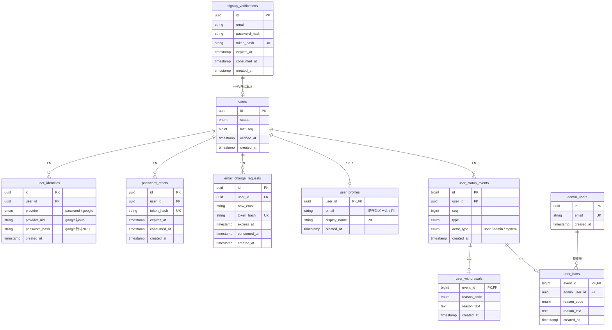

# ライフサイクル分離パターン

> 消えるタイミングが違うものは、同じテーブルに置かない。

`users` テーブルは、たいてい1枚から始まる。

`id`、`email`、`password`、`name`。そこに `status` が足される。次に `deleted_at` が足される。しばらくして `banned_at` も足される。1年後、このテーブルの全体像を説明できる人は誰もいない。

このドキュメントが扱うのは、その分かれ道だ。**消えるタイミングが違うものは、同じテーブルに置かない。** この方針をどこで使い、どこで使わないか。

題材は認証まわりを使う。ただし対象は `users` に限らない。テナントにも、投稿にも、サブスクリプションにも、同じ形が現れる。

---

# 第1部　壊れ方を知る

## 1. よくある壊れ方

先に、壊れた後の景色から見ておきたい。どれか1つは心当たりがあるはずだ。

| # | アンチパターン | 何が起きるか |
|---|---|---|
| 1 | **status enum の組み合わせ爆発** | `suspended_past_due` が生え、次に `suspended_past_due_withdrawing`。値が増えるたび全ての分岐を見直し、どこかで漏れる |
| 2 | **論理削除フラグの多重化** | `WHERE deleted_at IS NULL AND is_banned = false AND status='active'`。新しいクエリを書くたびに条件を書き忘れる |
| 3 | **理由の分からない BAN** | 3ヶ月後の異議申し立てに誰も答えられない |
| 4 | **解約理由が取れない** | 後から理由カラムを足しても過去分は永久に空欄 |
| 5 | **未検証ユーザーが users に混ざる** | 集計・メール送信・一覧の全てで除外条件が必要。捨てアドで users が埋まる |
| 6 | **`users.email` に UNIQUE** | 退会後に再登録できず、ダミーアドレス上書き運用が生まれ、本来のメールが失われる |
| 7 | **退会したいのに消せない** | PII を `users` に直接持ち、履歴が FK 参照。削除要求に対応できず「消したことにする」運用に |
| 8 | **認証状態と契約状態の混線** | ロックを `status='locked'` にすると、解除時に元の状態が分からず、未払い凍結中のユーザーが復活する |
| 9 | **直 UPDATE による履歴の穴** | 履歴と現在値が食い違い、どちらが正か分からなくなる。履歴があることが逆に判断を誤らせる |
| 10 | **BAN してもログインできる** | セッションを破棄しないと、トークン期限まで普通に使える |

### 共通する構造

どれも形は同じだ。機能一覧に無い要件を先送りする。後から1つずつ足す。そのたびに少しずつ歪む。

とくに 2 は「条件の書き忘れ」として語られやすい。だが本質はそこではない。**デフォルトが危険側に倒れている**ことだ。忘れたら漏れる設計は、いつか必ず漏れる。書く人の注意力の問題にしている限り、直らない。

テーブルを分ける。あるいは安全側のビューを正とする。どちらでもデフォルトが安全側に倒れる。

---

## 2. なぜ同じ壊れ方が繰り返されるのか

世の中の多くのプロダクトは、ここまでテーブルを分けていない。怠慢だからではなく、構造的な理由がある。

### 1. ライフサイクルは共通なのに、機能一覧に無いと先送りされる

**登録 → 利用 → 停止 → 退会 → 消去**。この流れは EC でも SaaS でも SNS でもほぼ同じだ。サービス内容によって変わらない。

にもかかわらず「まだ退会機能がないから」と `users` 1枚で始まる。これは、**まだ来ていないだけで来ることが確定している要件を無視している**ということだ。「最初は正しかった」ではない。「最初から分かっていたのに先送りした」が正確なところ。

とくに退会と PII 削除は、法令の側から来る要件になる。プロダクトの仕様判断ですらない。個人情報を扱う以上、削除要求はいつか必ず来る。要件が増えたのではなく、最初から存在していた。

この項目は要因というより、以下の 2〜5 を正当化するために使われる**言い訳の構造**に近い。

### 2. 足すコストが極端に安い

`ALTER TABLE ADD COLUMN` なら1分で終わる。テーブルを分けてコードを直せば半日かかる。**毎回その場では追加が合理的**だ。それを20回繰り返した結果として破綻する。個々の判断が正しくても全体が壊れる、典型的なパターンになる。

### 3. 壊れるのが設計者の任期の後

歪みが表に出るのは、退会が増え、サポート対応が発生し、削除要求が来てからだ。1〜2年後には、作った人は別のプロジェクトにいる。**痛みを負う人と設計する人が違う**ので、フィードバックが返らない。

### 4. 教材とフレームワークがそう教えている

Rails の scaffold も Laravel の認証スキャフォールドも、`users` 1枚に email と password を入れる形から始まる。チュートリアルに「退会したら PII を消す」は出てこない。**多数派の実装が参照実装になっている**。

### 5. サイレントに壊れる

`WHERE status='active'` を書き忘れた画面があったとする。退会ユーザーが少ないうちは、誰も気づかない。バグとして観測されないので、修正のきっかけが生まれない。

---

# 第2部　どこに使うか

## 3. 適用できるドメイン

このパターンは `users` 固有ではない。適用対象かどうかは、**寿命の形**で決まる。

| | パターン | 寿命の形 | 例 |
|---|---|---|---|
| **A** | 静的 | 状態が変わらない | 参照マスタ（都道府県、カテゴリ）、監査ログ |
| **B** | 従属 | 親と完全に一致し、同時に死ぬ | 設定値（通知、テーマ、言語） |
| **C** | 不滅 | 変わるが、終端が削除ではない | 注文、決済 |
| **D** | 独立 | 変わり、終端が削除 | **適用対象** |
| **E** | 凍結 | 動く形はあるが、環境が動かさない | 社内ツール、`admin_users`、プロトタイプ |

判定は上から順に落としていく。

> **状態が変わるか** → 変わるなら **寿命は親と別か** → 別なら **終端は削除か**

3つとも Yes なら D になる。判断軸（§4）が要るのは D の中だけだ。A〜C は当てるまでもなく決まるし、E は今は当てなくていい。

### 各パターンの注意点

**A（静的）** — 監査ログをここに置けるのは、改ざんしないことが要件そのものだからだ。参照マスタも、税率のように改定履歴が要るなら C に移る。「マスタだから静的」ではない。

**B（従属）** — `user_profiles` と見分けがつきにくい。どちらも `users` と 1:1 なのに、片方は分ける。違いは**終端**にある。設定値は `users` と同時に死ぬ。PII は `users` より先に死ぬ（`users` は FK の宛先として残る）。**1:1 かどうかでは判定できない。**

**C（不滅）** — 注文の状態は変わる。pending → paid → shipped と遷移する。分けない理由は「変わらないから」ではない。法令上の保持義務があるため、**削除が匿名化に置き換わる**からだ。§5-2 と同じ構造になる。

**E（凍結）** — 唯一、テーブルの性質ではなく**環境**で決まるパターンだ。社内ツールには退会がない。`admin_users` は増えも消えもしない。プロトタイプは捨てる前提。ただし前提が変われば D に移動する。社内ツールが顧客向けになる。捨てるつもりが本番になる。移動時に一番高くつくのが PII なので、**E でも `users` からの PII 分離だけはやっておく**方が安い。

### D に入るドメイン

| ドメイン | なぜ D か |
|---|---|
| **テナント / 組織** | 解約時に `users` と同じ問題が起きる。BtoB SaaS では `users` より先に効く |
| **投稿・コンテンツ** | 削除・非公開・通報による凍結があり、「なぜ消えたか」を答える必要がある。`users` とほぼ同じ構造 |
| **サブスクリプション** | 状態遷移が多く、履歴がないと課金トラブルに答えられない |
| **トークン類** | 消える契機と書く主体が別。寿命が短く丸ごと消える点は共通でも分ける |

トークン類を1つの `tokens` テーブルに `type` で詰めるとどうなるか。signup の時点ではまだ user がいないので、`user_id` が NULL 可になる。NULL の軸に引っかかる。

**寿命の短さは、分けない理由にならない。**

### 何が要るかは問いごとに決まる

D かどうかは全体の適用可否の話だ。**どの部品が要るか**は、別の3つの問いで決まる。

| 問い | Yes なら要る部品 |
|---|---|
| **削除要求が来るか** | PII の分離（`user_profiles` 相当） |
| **状態が変わるか** | 状態を1箇所に集約し、更新を1本の関数に寄せる |
| **なぜそうなったか聞かれるか** | 履歴テーブル + 種別ごとの詳細テーブル |

3つは独立している。C（注文）は削除要求が匿名化に置き換わるので1つ目が要らない。だが2つ目と3つ目は要る。E（社内ツール）なら1つ目だけ先にやる。

**D 以外でも、部品単位では要る。** ここを一括りにすると「うちは退会がないから全部不要」という飛躍が起きる。

---

# 第3部　どう判断するか

## 4. 分けるかどうかの3つの問い

テーブルを分けるかどうかで迷ったら、この3つで判断する。

| 軸 | 問い |
|---|---|
| **NULL** | 分けた結果、**NULL が本当に減る**か |
| **削除** | 分けた結果、**片方だけ消せるようになる**か |
| **権限** | 分けた結果、**書ける主体を実際に絞れる**か |

いずれにも当てはまらないなら分けない。JOIN が増えるだけだ。

### 補助的な問い

- **ライフサイクルが違うか** — 消えるタイミングが違うものは分ける。同じ寿命のものを分けても意味がない
- **存在しないことに意味があるか** — 「行が無い = 該当しない」で表現できるなら分ける。NULL だと「未設定」と「該当なし」が区別できない
- **書き込む主体が違うか** — 管理者 / 本人 / システム。同じテーブルだと権限を絞れない

### よくある誤り

「カラムが増えてきたから分ける」は、理由として弱い。

`display_name` / `avatar_url` / `bio` は常に一緒に読み書きする。20個あっても1テーブルが正しい。

---

## 5. 分けない方がよい場合

3つの軸は、当てはまらないときより **当てはまっているつもりで効いていないとき**に失敗する。

分けると、JOIN が増える。トランザクションの範囲も広がる。DB で守れていた制約も失う。このコストは確実に払うことになる。それに見合うはずのメリットが幻だったら、差し引きで損をする。

### 軸が効いていない4つの形

**1. NULL の偽装 — NULL が行の不在に移っただけ**

全ユーザーが必ず持つものを `1:0..1` で分けたとする。NULL は消えない。代わりに「行が無い」という新しい異常系ができる。1:1 必須は DB 制約で表現できないので、全ての read が LEFT JOIN と null チェックになる。

§1-2（条件の書き忘れ）と同じ構造が、WHERE 句から JOIN 句へ移動しただけだ。デフォルトが危険側なのは変わっていない。

分けてよいのは、**本当に行が無いことがある**場合だけになる。`user_profiles` の 0..1 が正当なのは、退会猶予の後に消えるからだ。NULL 削減が理由ではない。

**2. 削除の偽装 — 削除でなく匿名化で足りる**

EC・金融・会計では、法令の側の保持義務で完全削除ができない。正解が「PII を消す」ではなく「PII をマスクする」なら、`UPDATE` 一発で終わる。分割の対価には見合わない。

**3. 削除の部分最適 — PII が DB の外に散っている**

セッションストアに載る IP アドレス。`reason_text`。メール配信サービスのログ。Stripe。APM のトレース。

真の削除範囲が DB の外にあるなら、`user_profiles` の物理削除は**「消したつもり」を作るだけ**になる。むしろ危険側に倒れる。分離が正当化されるのは、削除範囲の棚卸しが済んでいて「ここを消せば完了」と言えるときだけだ。

**4. 権限の偽装 — アプリ層でしか絞れていない**

書ける主体を実際に絞るには、DB ロールの分離か、RLS か、別 DB のいずれかが要る。単一の DB バインディングで認可がアプリ層に集約されているなら、テーブルを分けても書ける主体は1ミリも変わらない。

得られるのは「将来絞れる余地」であって、今日の安全性ではない。**それを安全性として計上しない。**

### コスト側で分割が負ける場合

| 状況 | 何が起きるか | 取るべき手 |
|---|---|---|
| 読み取りホットパス | 認証は毎リクエスト走る。セッション照会 →`users`→`user_profiles` と往復が積む | 分割はする。そのうえで read model を別に用意するか、JOIN を1本に固定する |
| 仕様が未確定 | 間違った線で分けると、戻すのは分けるより高い。FK・型・フィクスチャが全部分かれた後になる | 後戻りコストの高い分離（PII）だけ先にやる。§13 の適用順に従う |
| 制御状態 | 現在値を履歴から集計する形にすると排他が壊れる | §8「現在値と履歴、どちらが正か」を参照 |

### まとめ

分けない理由として弱いのは「カラムが少ないから」。

強いのは、**3つの軸のどれも、今の構成で効いていることを示せない**ことだ。

---

## 6. 規模に応じて削れるもの

規模を理由に削るなら、**後から戻せるかどうか**で判断する。

### 最初から要る（後戻りが高くつく）

- **PII を `users` から分離する** — 後から分離するのは FK の張り替えで大手術になる
- **未検証ユーザーを `users` に入れない** — 入れると全クエリに条件が付く。抜くにはデータ移行が要る
- **`users` に PII の UNIQUE を張らない** — ダミー email 上書きの直接の原因になる

### 後から足せる（ただし過去分は失われる）

- 履歴テーブル
- BAN / 退会の専用テーブル

### 規模が小さいうちは省いてよい

- `users.status` のキャッシュと `last_seq` の楽観ロック。素直に履歴から集計する方が安全。二重に真実を持つ部分は歪みの種でもある

---

# 第4部　実際に設計する

ここからは具体例になる。認証まわりに、ここまでの判断を当てはめるとどうなるか。

## 7. 全体構成



### ライフサイクルごとの区分

| 区分 | テーブル | 消えるタイミング |
|---|---|---|
| **本体** | `users` | 消えない。FK の宛先 |
| **付随情報** | `user_profiles` / `user_identities` | 退会猶予の経過後に物理削除 |
| **接続** | Workers KV（`SESSIONS_KV`） | ログアウト・BAN・退会・期限切れ（TTL） |
| **変更履歴** | `user_status_events` + 詳細テーブル | 消えない |
| **使い捨てトークン** | `signup_verifications` / `password_resets` / `email_change_requests` | 消費・期限切れの後に削除 |

同じ行に置いたら、この5つのタイミングが1つに縛られる。それが分ける理由になる。

---

## 8. 設計の柱

- **未検証のサインアップは `users` を作らない。** URL 検証の後に初めてユーザーが存在する。「未検証を弾き忘れる」がテーブル構造で防がれる
- **`users` は不変の同一性のみ。** PII は `user_profiles`、認証手段は `user_identities` に置く。退会時に PII だけ物理削除しても FK が壊れない
- **ステータス変更は履歴を積む。** `users.status` は履歴を毎回集計しないためのキャッシュ。更新は必ず1本の関数を経由する
- **履歴テーブルは共通項目のみ固定。** 種別に固有の情報は `event_id` を PK 兼 FK にした専用テーブルへ。種別が増えてもスキーマが変わらない
- **トークンは生値を保存しない。** 全て `token_hash` + `expires_at` + `consumed_at` の同じ形にする。発行・照合・消費は共通ヘルパーに寄せる
- **`from_status` は持たない。** 直前の行から分かるうえ、前行の `to` と食い違う不整合が起こり得る

### 現在値と履歴、どちらが正か

上の「履歴を積む」は `users` では正しい。ただし**すべての状態に当てはまるわけではない**。実行状態 / 実行履歴パターンとして切り分ける。

| | 正 | もう一方 | 理由 |
|---|---|---|---|
| `users.status` | **履歴** | `status` カラムは集計を避けるキャッシュ | BAN・退会は後から「誰がいつなぜ」を問われる事実。追記でしか作らない |
| 送信ジョブ等の実行状態 | **現在値** | 試行記録は調査用の追記 | `WHERE status='pending'` の条件付き UPDATE そのものが排他制御 |

実行状態を履歴集計で組むとどうなるか。読む → 集計する → 書く、の間に他のワーカーが割り込む。二重実行になる。

逆に `users.status` を直 UPDATE すると §1-9（履歴の穴）になる。**同じ取り違えの裏表だ。**

実行状態の側を分けるなら、本体（1行を UPDATE）と試行記録（append）で分ける。試行記録の方が肥大化が速いので、保持期間を短く切れる。

ただし冪等性は status では守れない。判定と INSERT の間が空くからだ。`UNIQUE(idempotency_key)` と `ON CONFLICT DO NOTHING` で守る。

---

## 9. 書き込みの順序

同一 Tx、順序は固定する。ステータス変更のときはこうなる。

1. `user_status_events` に1行 INSERT
2. 固有情報があれば `user_withdrawals` / `user_bans` に1行 INSERT
3. `UPDATE users SET status=?, last_seq=? WHERE id=? AND last_seq=?`

順序を固定するとデッドロックを避けやすい。外部 API（Stripe 等）の呼び出しは Tx の外に置く。

### セッション破棄は Tx の外（Queues 経由）

BAN・退会・パスワードリセットのときはセッションを全破棄するが、**KV は D1 の Tx に入らない**。同じ Tx で消そうとすると、D1 はコミット済みで KV の削除だけ失敗、という部分失敗が起こる。セッションが生き残るので BAN が効かない。

そこで Tx の外に出して、再試行可能にする。

1. D1 の Tx をコミット（履歴 + `users` 更新）
2. Queues に `{ userId, reason }` を投入
3. コンシューマが `list({ prefix: 'session:user:<userId>:' })` で引き、各キーを削除

Queues 側にリトライと DLQ があるので、失効の状態機械を自前で持たない。削除は冪等なので再実行しても安全。

**Tx のコミットから削除の完了までの間、セッションは有効。** KV の伝播遅延と合わせて許容する。

---

## 10. 認証の決定事項

| 項目 | 決定 |
|---|---|
| セッション | Workers KV（`SESSIONS_KV`）に保存、毎リクエスト参照 |
| 寿命 | 7日。`expirationTtl` で自動失効。**延長はしない**（7日で必ず再ログイン） |
| 失効ラグ | 最大60秒。BAN の後もその間は通り得る。許容する |
| 多重ログイン | 可 |
| ローテーション | なし |
| ロックアウト | 今回スコープ外（問い合わせベースで管理者解除） |
| OAuth | Google のみ |
| 同一メールの紐付け | 自動。ただし `email_verified=true` を条件に |

### セッションを KV に置く

D1 のテーブルにしないのは、**期限切れセッションの削除バッチが不要になる**のが大きい。`expirationTtl` で消えるので、バッチが止まったときに期限切れセッションが生き残る、という障害モードごと無くなる。毎リクエストの D1 読み取りも消える。

代わりに払うのが失効ラグ（最大60秒）で、これは許容する判断。**この設計は「速いセッションテーブル」ではなく「ラグの短い JWT」** に近い。短命 JWT なら最大15分のところが60秒になる、という位置づけで理解する。

#### キー設計

```
session:user:<userId>:<tokenHash>
session:admin:<adminId>:<tokenHash>
```

値はセッション本体の JSON（`userAgent` / `ipAddress` / `createdAt`）。`expiresAt` は持たず `expirationTtl` に任せる。二重に真実を持たない。

**`userId` をキーに含めるのが要点。** `session:user:<tokenHash>` だと `userId` から引けず、BAN・パスワード変更・「他の端末からログアウト」が全滅する。前方一致で `list()` できる形にしておく。

接頭辞で user と admin を分けているので、**一般ユーザーの認証パスから admin セッションを掴むことが構造的にできない**。1テーブルに `is_admin` を持つ場合の「`WHERE` の書き漏れによる権限昇格」に相当するものが存在しない。ただしこれは書ける主体を絞っているわけではなく（同一 Worker から両方に書ける）、取り違えを防いでいるだけ（→ §5「権限の偽装」）。

`ipAddress` は PII だが、TTL で自動的に消えるのは有利。ただし削除要求で「今すぐ全部消す」に応えるには前方一致の `list()` が要る。ここでも `userId` がキーに入っていることが効く。

### Google 初回ログイン

1. `(google, sub)` で `user_identities` を検索 → 無い
2. `user_profiles.email` で既存ユーザーを検索
   - 居る → その `user_id` に google の identity 行を追加
   - 居ない → `users` 一式を新規作成
3. 同メールの未消費 `signup_verifications` を無効化（二重登録の防止）
4. セッション発行

識別子は email ではなく **`sub`** を使う。email は変更され得るからだ。

Google 側でメールが変わっても `user_profiles.email` は上書きしない。

### メール変更

新しいアドレスにトークンを送る。検証の後に `user_profiles.email` を更新する。そして**旧アドレスにも通知する**。乗っ取りの検知のためだ。

---

## 11. API 一覧

### 認証不要

| ユースケース | I/F | 操作テーブル |
|---|---|---|
| サインアップ申込 | `POST /auth/signup` | `signup_verifications` INSERT |
| 認証URL検証 | `POST /auth/signup/verify` | `signup_verifications` UPDATE / `users`,`user_profiles`,`user_identities`,`user_status_events`,KV PUT |
| 認証メール再送 | `POST /auth/signup/resend` | `signup_verifications` UPDATE,INSERT |
| パスワードログイン | `POST /auth/login` | `user_profiles`,`user_identities`,`users` SELECT / KV PUT |
| Google認証開始 | `GET /auth/google` | — |
| Googleコールバック | `GET /auth/google/callback` | `user_identities`,`user_profiles` SELECT / `users` 一式 INSERT / `signup_verifications` UPDATE / KV PUT |
| リセット要求 | `POST /auth/password/reset-request` | `password_resets` UPDATE,INSERT |
| リセット実行 | `POST /auth/password/reset` | `password_resets` UPDATE / `user_identities` UPDATE / KV 削除（Queues） |
| メール変更検証 | `POST /auth/email/verify` | `email_change_requests` UPDATE / `user_profiles` UPDATE |

### ユーザー

| ユースケース | I/F | 操作テーブル |
|---|---|---|
| ログアウト | `POST /auth/logout` | KV 削除（当該キーのみ、即時） |
| 自分の情報 | `GET /me` | `users`,`user_profiles` SELECT |
| プロフィール更新 | `PATCH /me` | `user_profiles` UPDATE |
| パスワード変更 | `PUT /me/password` | `user_identities` UPDATE / KV 削除（Queues） |
| メール変更要求 | `POST /me/email` | `email_change_requests` UPDATE,INSERT |
| 退会 | `POST /me/withdraw` | `user_status_events`,`user_withdrawals` INSERT / `users` UPDATE / KV 削除（Queues） |
| 退会取消 | `POST /me/withdraw/cancel` | `user_status_events` INSERT / `users` UPDATE |

### 管理者

| ユースケース | I/F | 操作テーブル |
|---|---|---|
| ユーザー検索 | `GET /admin/users?email=` | `users`,`user_profiles` SELECT |
| ユーザー詳細 | `GET /admin/users/:id` | `users`,`user_profiles`,`user_identities` SELECT |
| 状態変更履歴 | `GET /admin/users/:id/events` | `user_status_events` + 詳細テーブル LEFT JOIN |
| BAN | `POST /admin/users/:id/ban` | `user_status_events`,`user_bans` INSERT / `users` UPDATE / KV 削除（Queues） |
| BAN解除 | `POST /admin/users/:id/unban` | `user_status_events` INSERT / `users` UPDATE |

### Webhook / バッチ

| ユースケース | 操作テーブル |
|---|---|
| Stripe受信 | `user_status_events` INSERT / `users` UPDATE / KV 削除（Queues） |
| 退会猶予経過分のPII削除 | `user_profiles`,`user_identities` DELETE |
| 消費済み・期限切れトークン削除 | 各トークンテーブル DELETE |

---

# 第5部　運用に乗せる

## 12. 運用で決めておくこと

- `admin_users` は物理削除しない（BAN 履歴から参照される）
- PII の物理削除は退会 Tx に含めず、猶予期間の後のバッチで行う
- 猶予期間の中は同じメールで再登録できない。案内が要る
- 退会後の再登録は許すが `user_id` は別にする。過去の履歴と繋がらない旨を UI で明示する
- `reason_text` に個人情報が混ざる前提で、削除対象に含めるか決める
- セッションは7日で必ず切れる（延長なし）。利用の途中で落ちるので、再ログインの導線と「入力中の内容が消える」ケアが要る
- KV は同一キーへの書き込みが毎秒1回まで。セッションの値を書き直す処理を足すときはここに当たる
- BAN のセッション破棄は Queues 経由なので、DLQ の監視が要る。溜まっている = BAN が効いていないユーザーが居る

---

## 13. 既存プロダクトに後から入れる

全部やり直すのは現実的ではない。後戻りコストの高い順に手をつける。

| 優先度 | やること | 理由 |
|---|---|---|
| **今すぐ** | `users` から PII を剥がす | 参照が増えるほど FK の張り替えが高くつく |
| **次** | 履歴テーブルを足す | 過去分は諦めて今日から積む。後から足せる |
| **後でいい** | status の分解 | 既存の分岐が全部絡む。要件追加のタイミングに合わせる |

新規プロダクトなら、初日にやれば追加コストは数時間で済む。

外部から入る立場なら、「全部直す」より **PII 分離だけ先に提案する**方が通りやすい。

---

## 14. 今回スコープ外

- ログイン試行回数によるロックアウト（`users.status` とは別軸で持つこと）
- セッション一覧・個別ログアウトの画面
- 二要素認証
- Google 以外の OAuth provider（追加時は `email_verified` の検証が必須）
