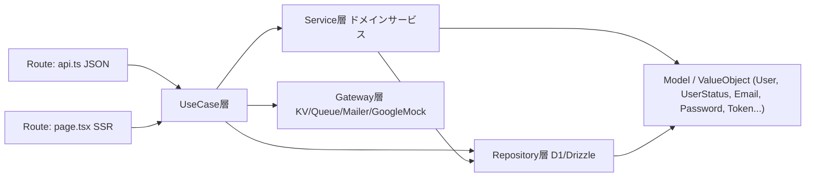

# 設計書

## 1. 概要

本設計書は、要件定義書に定義した「ステータスのライフサイクル検証」を、Cloudflare Workers + Hono + D1 + KV + Queues 上で実装するための仕様である。

原設計（ライフサイクル分離パターン適用例）のテーブル設計・書き込み順序・アンチパターン回避の意図を継承しつつ、ヒアリングで確定した次の差分を反映する。

| 項目 | 原設計 | 本プロジェクト確定仕様 |
|---|---|---|
| セッション保存先 | D1 `sessions` | Workers KV `SESSIONS_KV`（`sessions` / `admin_sessions` テーブルは作らない） |
| セッション延長 | 残り閾値でスライド | **7日固定・延長なし**。`POST /auth/refresh` 廃止、`last_used_at` なし |
| 一括セッション破棄 | 同一 Tx で D1 DELETE | D1 コミット後に Queue 投入 → KV `list(prefix)` 削除（失効ラグ最大約60秒許容） |
| 管理者認証 | 未記載（admin_users に password なし） | `admin_users.password_hash` + `POST /admin/login` |
| 複数 DB 更新 | 対話的 Tx | D1 `db.batch([...])`（楽観ロックは単発 events INSERT → batch([詳細, users UPDATE]) の2段階） |
| Google OAuth | 実 Google | ローカルモック（APIキー不要） |
| UI | 最小限 | hono/jsx SSR でユーザー／管理者の一連画面 |
| 課金 Webhook | Stripe あり | スコープ外 |
| 期限切れセッション削除バッチ | あり | **不要**（KV `expirationTtl`） |

---

## 2. アーキテクチャ

### 2.1 方針

- **DDD like** なレイヤー構成。**クラスベース**（関数型スタイルは採用しない）
- 依存は一方向: `route → usecase → service → repository / gateway`（Domain は下位層から参照）
- ドメインロジック（不変条件・状態遷移可否など）は **Model / ValueObject** に集約し、UseCase / Service に if 文が散らばるのを防ぐ
- DI は軽量に、Hono Context から都度組み立てる `createContainer(c)` のみ。重量な DI コンテナは導入しない

### 2.2 構成図



### 2.3 層の責務

| 層 | 配置 | 責務 |
|---|---|---|
| **Route** | `presentation/api/*.ts`, `presentation/pages/*.tsx` | HTTP 入出力の変換のみ。**valibot** でリクエスト／フォーム入力を検証し、成功した値だけを DTO として UseCase に渡す。不正入力はこの層で 400（または画面 flash）を返す。ビジネスロジックは持たない |
| **UseCase** | `usecases/**/*.ts` | 1操作＝1クラス。Service / Repository / Gateway の呼び出し順序を組み立てるオーケストレーション。Tx 境界（batch 呼び出し）はここまたは Service。生の外部入力は受け取らない |
| **Service** | `services/*.ts` | 複数集約にまたがるドメインロジック（例: `UserStatusTransitionService`, `SessionService`, **`CurrentLifecycleStateResolver`**） |
| **Repository** | `repositories/*.ts` | D1/Drizzle 永続化を集約単位でラップ。「単発 events INSERT → batch([詳細, users UPDATE])」の実装詳細はここに閉じ込め、呼び出し側には「原子的に状態遷移する」IF だけを見せる |
| **Gateway** | `gateways/*.ts` | 外部・インフラ（Mailer、GoogleAuthMock、SessionKv、SessionRevocationQueue） |
| **Domain** | `domain/**/*.ts` | `User` エンティティ、`UserStatus` / `Email` / `Password` / `Token` / `ReasonCode` / **`UserLifecycleStateLabel`** 等 VO。`canTransitionTo()` や生成・検証を保持 |

API 用ハンドラと画面用ハンドラは同じ UseCase を共有し、ロジックを重複させない。画面 POST は **PRG**（Post-Redirect-Get）とし、結果メッセージは `lib/flash.ts` の一時 Cookie で伝える。

### 2.3.1 バリデーション方針（valibot）

- **ライブラリ**: `valibot`（最新安定版）および Hono 連携に `@hono/valibot-validator`
- **用途**: HTTP API（JSON body / query）および SSR 画面のフォーム入力の検証
- **配置**: `src/presentation/schemas/` にリクエスト単位のスキーマを定義（presentation 層の責務として集約）
- **境界**: Route で `v.safeParse` 相当（`@hono/valibot-validator` 経由）により検証し、成功した値だけを UseCase に渡す。不正入力は Route で `400` / `validation_error`（画面は flash）を返す。UseCase / Service / Domain には生の外部入力を持ち込まない
- **責務分担**: Route のスキーマ検証は **入力境界の形状・型・最低限の形式チェック**。Domain の ValueObject（`Email` / `Password` 等）の不変条件チェックは当面そのまま維持し、**ドメイン不変条件**として別責務とする
- **Hono 統合**: `@hono/valibot-validator` の `vValidator` を採用する。ミドルウェア利用が難しい箇所（一部フォームの手動組み立て等）では Route 内で `v.safeParse` を直接呼んでもよい

### 2.4 `createContainer(c)`

```typescript
// 概念図（実装時の指針）
function createContainer(c: Context) {
  const db = createDb(c.env.DB);
  const userRepo = new UserRepository(db);
  // ... repositories
  const sessionKv = new SessionKvGateway(c.env.SESSIONS_KV);
  const revocationQueue = new SessionRevocationQueueGateway(c.env.SESSION_REVOCATIONS);
  const mailer = new MailerGateway(c.env.APP_BASE_URL);
  // ... services, usecases
  return { /* usecases */ };
}
```

Route は `const { banUser } = createContainer(c)` のように取得して呼び出す。

---

## 3. ディレクトリ構成

create-hono の `cloudflare-workers+vite` テンプレート生成物をプロジェクト直下へ配置したうえで、以下へ拡張する。

```
/
  package.json
  wrangler.jsonc                 # toml は使わない
  vite.config.ts                 # cloudflare() + ssrPlugin() + @tailwindcss/vite
  drizzle.config.ts
  biome.json
  .dev.vars.example
  drizzle/                       # drizzle-kit generate 出力
  scripts/
    seed.ts                      # ローカル用シード（admin 5 / user 16 / signup_verifications 別枠5行）。旧 seedAdmin.ts 相当を包含
  src/
    index.ts                     # Hono app、ルーティング、scheduled / queue ハンドラ export
    container.ts                 # createContainer(c)
    config.ts                    # TTL 等の定数
    style.css                    # @import "tailwindcss"（v4）
    db/
      schema.ts                  # 全テーブル（sessions/admin_sessions なし、admin_users.password_hash あり）
      client.ts                  # drizzle(env.DB)
    domain/
      user/
        User.ts
        UserId.ts
        UserStatus.ts
      admin/
        AdminUser.ts
      shared/
        Email.ts
        Password.ts
        Token.ts
        ReasonCode.ts
        UserLifecycleStateLabel.ts   # 表示用派生ラベル VO（§16.2.2）
    repositories/
      UserRepository.ts
      UserProfileRepository.ts
      UserIdentityRepository.ts
      SignupVerificationRepository.ts
      PasswordResetRepository.ts
      EmailChangeRequestRepository.ts
      AdminUserRepository.ts
      UserStatusEventRepository.ts
      UserWithdrawalRepository.ts
      UserBanRepository.ts
      SeedUserLabelRepository.ts
      SeedSignupLabelRepository.ts
    gateways/
      MailerGateway.ts
      GoogleAuthMockGateway.ts
      SessionKvGateway.ts
      SessionRevocationQueueGateway.ts
    services/
      PasswordHashingService.ts
      TokenIssuingService.ts
      SessionService.ts
      UserStatusTransitionService.ts
      CurrentLifecycleStateResolver.ts  # 検証トップ「現在の状態」合成（§16.2.2）
    usecases/
      signup/
        SignupUseCase.ts
        VerifySignupUseCase.ts
        ResendSignupVerificationUseCase.ts
      login/
        LoginUseCase.ts
      google/
        GoogleLoginUseCase.ts
      passwordReset/
        RequestPasswordResetUseCase.ts
        ResetPasswordUseCase.ts
      emailChange/
        RequestEmailChangeUseCase.ts
        VerifyEmailChangeUseCase.ts
      me/
        GetMeUseCase.ts
        ChangePasswordUseCase.ts
        UpdateProfileUseCase.ts      # PATCH /me（画面なし）
      withdraw/
        WithdrawUseCase.ts
        CancelWithdrawUseCase.ts
      admin/
        AdminLoginUseCase.ts
        SearchUsersUseCase.ts
        GetUserDetailUseCase.ts
        BanUserUseCase.ts
        UnbanUserUseCase.ts
      batch/
        PurgeWithdrawnPiiUseCase.ts
        PurgeExpiredTokensUseCase.ts
    presentation/
      api/
        signup.ts
        login.ts
        google.ts
        passwordReset.ts
        emailChange.ts
        me.ts
        withdraw.ts
        admin.ts
        internalBatch.ts
      pages/
        homePage.tsx             # GET /（POC検証トップ。認証不要）
        signupPage.tsx
        loginPage.tsx
        mypagePage.tsx
        googleMockConsentPage.tsx
        passwordResetPages.tsx
        emailChangePages.tsx
        adminLoginPage.tsx
        adminUsersListPage.tsx
        adminUserDetailPage.tsx
      schemas/                   # valibot スキーマ（リクエスト／フォーム単位）
        signup.ts
        login.ts
        passwordReset.ts
        emailChange.ts
        me.ts
        withdraw.ts
        admin.ts
      renderer.tsx               # hono/jsx-renderer + ViteClient/Script
      components/
        statusBadge.tsx
        eventTimeline.tsx
    middleware/
      requireUser.ts
      requireAdmin.ts
      requireUserPage.ts
      requireAdminPage.ts
    lib/
      flash.ts
      errors.ts
```

---

## 4. プロジェクト雛形・ビルド

1. `npm create hono@latest` で **cloudflare-workers+vite** を選択し、一時ディレクトリに生成
2. 生成物（`src/`, `package.json`, `wrangler.jsonc`, `vite.config.ts` 等）を **リポジトリ直下へ移動**し、一時ディレクトリを削除
3. 直後に依存（hono, `@cloudflare/vite-plugin`, `vite-ssr-components`, wrangler, vite 等）を **最新バージョンへ更新**
4. `drizzle-orm@0.44.6`, `drizzle-kit@0.31.4`, `better-sqlite3@11.8.1`, `@biomejs/biome@2.2.5`, Tailwind v4 関連を追加
5. `valibot`（最新安定版）と `@hono/valibot-validator` を追加
6. ローカル起動は `npm run dev`（内部 `vite dev`）。`wrangler.dev` 直叩きは基本としない

`vite.config.ts` は雛形の `cloudflare()` + `ssrPlugin()` に `@tailwindcss/vite` を追加する。

---

## 5. ライフサイクル分離の要約（実装に必要な決定）

### 5.1 適用判断（原設計 §1〜3）

- 判断軸: **NULL が減るか / 片方だけ消せるか / 書ける主体を絞れるか**。当てはまらなければ分けない
- 注意: 「カラムが増えたから分ける」は弱い。`display_name` / `avatar_url` 等は同居でよい
- **権限の偽装**（原設計 §3-4）: テーブルやキー接頭辞を分けても、単一 Worker バインディングでは権限分離にならない。本プロジェクトの user/admin キー接頭辞は **権限分離ではなく、認証パスの取り違え防止**が目的である（自己言及として明記）
- **status 詳細の分割**: 退会・BAN など **フォーム項目が type ごとに異なる**ため詳細表を分ける（Class Table Inheritance）。将来列追加の影響半径を種別内に閉じる。共通の「誰が」はフォームではないので `user_status_events.actor_id` に上げる。詳細無し type（`activated` / `withdraw_cancelled`）を許容する
- **詳細表の規約**: テーブル名 `user_{event_type 名詞形}`、PK は `(user_id, seq)`（events と同じ自然キー）、フォーム由来の共通列名（`reason_code` / `reason_text` / `created_at`）を揃える。「理由付き BAN／退会」の不変条件は跨ぎテーブル CHECK では守れないため、**event INSERT と詳細 INSERT を同一 D1 batch に載せること**が唯一の保証

### 5.2 避けたいアンチパターン（原設計 §5、実装での防ぎ方）

| # | アンチパターン | 本設計での防ぎ方 |
|---|---|---|
| 1 | status enum の組み合わせ爆発 | 契約状態などを混ぜず、認証ライフサイクルの少数 status のみ |
| 2 | 論理削除フラグの多重化 | `users.status` 1箇所。除外条件のばら撒きを避ける |
| 3 | 理由の分からない BAN | `user_bans.reason_code` / `reason_text`（events と同一 batch） |
| 4 | 解約理由が取れない | `user_withdrawals` を退会時に必須 INSERT（同一 batch） |
| 5 | 未検証ユーザーが users に混ざる | 検証前は `signup_verifications` のみ。検証成功時に初めて `users` 作成 |
| 6 | `users.email` UNIQUE | email は `user_profiles`。退会後再登録可能（別 user_id） |
| 7 | 退会したいのに消せない | PII を profiles/identities に分離し、猶予後バッチで物理削除 |
| 8 | 認証と契約の混線 | 課金状態は本スコープ外。status にロックアウト等を載せない |
| 9 | 直 UPDATE による履歴の穴 | ステータス変更は必ず events（+詳細）経由の1本関数 |
| 10 | BAN してもログインできる | Queue 経由で該 user の KV セッションを一括削除 |

### 5.3 テーブル寿命区分（原設計 §8、セッションは KV に変更）

| 区分 | 実体 | 消えるタイミング |
|---|---|---|
| 本体 | `users` | 消えない（FK 宛先） |
| 付随情報 | `user_profiles`, `user_identities` | 退会猶予経過後に物理削除 |
| 接続 | KV `session:user:...` / `session:admin:...` | ログアウト・一括失効・`expirationTtl` |
| 変更履歴 | `user_status_events` + 詳細 | 消えない |
| 使い捨てトークン | signup / password_reset / email_change | 消費・期限切れ後にバッチ削除 |
| シード固定ラベル（POC） | `seed_user_labels` / `seed_signup_labels` | 通常は消えない（再シード時のみ入れ替え）。操作で変わらない。**本番スキーマと同一マイグレーションに同居**（移植時は分離候補） |

### 5.4 設計の柱（原設計 §9）

- 未検証サインアップでは `users` を作らない
- `users` は不変の同一性のみ（id / status cache / last_seq / verified_at / timestamps）
- ステータス変更は履歴を積み、`users.status` はキャッシュ。更新は1経路
- 履歴は共通項目のみ（誰が・いつ・何が）。種別固有のフォーム入力は `(user_id, seq)` PK の詳細テーブル。操作者は `actor_id`
- トークン生値は保存しない
- `from_status` は持たない（直前行から分かる。食い違いの種になる）

---

## 6. DB スキーマ（D1 / Drizzle）

`sessions` / `admin_sessions` は **作らない**。

### 6.1 ER 概略

```mermaid
erDiagram
    signup_verifications ||--o| users : "verify時に生成"
    users ||--o{ user_identities : "1:N"
    users ||--o{ password_resets : "1:N"
    users ||--o{ email_change_requests : "1:N"
    users ||--o| user_profiles : "1:0..1"
    users ||--o{ user_status_events : "1:N"
    users ||--o| seed_user_labels : "シード初期ラベル"
    signup_verifications ||--o| seed_signup_labels : "シード初期ラベル"
    user_status_events ||--o| user_withdrawals : "0..1 by user_id,seq"
    user_status_events ||--o| user_bans : "0..1 by user_id,seq"
    user_status_events ||--o| user_unbans : "0..1 stub"
    admin_users ||--o{ user_status_events : "actor_id"
    admin_users ||--o{ admin_audit_logs : "監査"

    users {
        text id PK
        text status
        integer last_seq
        text verified_at
        text created_at
        text updated_at
    }

    user_identities {
        text id PK
        text user_id FK
        text provider
        text provider_uid
        text password_hash
        text created_at
    }

    user_profiles {
        text user_id PK_FK
        text email
        text display_name
        text created_at
        text updated_at
    }

    signup_verifications {
        text id PK
        text email
        text password_hash
        text token_hash UK
        text expires_at
        text consumed_at
        text created_at
    }

    password_resets {
        text id PK
        text user_id FK
        text token_hash UK
        text expires_at
        text consumed_at
        text created_at
    }

    email_change_requests {
        text id PK
        text user_id FK
        text new_email
        text token_hash UK
        text expires_at
        text consumed_at
        text created_at
    }

    admin_users {
        text id PK
        text email UK
        text password_hash
        text created_at
        text disabled_at
    }

    user_status_events {
        integer id PK
        text user_id FK
        integer seq
        text type
        text actor_type
        text actor_id
        text created_at
    }

    user_withdrawals {
        text user_id PK
        integer seq PK
        text reason_code
        text reason_text
        text created_at
    }

    user_bans {
        text user_id PK
        integer seq PK
        text reason_code
        text reason_text
        text created_at
    }

    user_unbans {
        text user_id PK
        integer seq PK
        text created_at
    }
```

### 6.2 テーブル定義（列・制約）

UUID は text（ULID または UUID 文字列）。timestamp は ISO 8601 text、または integer(unix) のいずれかに実装で統一する（本設計では **ISO 8601 text** を採用）。

#### `users`

| 列 | 型 | 制約 | 説明 |
|---|---|---|---|
| id | text | PK | 不変の同一性 |
| status | text | NOT NULL | `active` / `withdrawn` / `banned` |
| last_seq | integer | NOT NULL DEFAULT 0 | 楽観ロック・イベント連番の現在値 |
| verified_at | text | NOT NULL | **アカウント確定時刻**（メール verify 完了、または Google 初回作成時の callback 時刻） |
| created_at | text | NOT NULL | |
| updated_at | text | NOT NULL | |

#### `user_profiles`

| 列 | 型 | 制約 | 説明 |
|---|---|---|---|
| user_id | text | PK, FK→users.id | 1:0..1（PII 削除後は行なし） |
| email | text | NOT NULL | 現行メール。**通常の UNIQUE インデックス**（部分インデックスではない）。猶予中も行が残るため同一 email の再登録は拒否され、PII purge（物理削除）後に再登録可能 |
| display_name | text | NOT NULL | |
| created_at / updated_at | text | NOT NULL | |

運用: 重複判定は **プロフィール行の存在**（`users.status` 不問）。猶予中（withdrawn）も行があれば signup / メール変更を拒否。PII 削除後は再登録可（別 user_id）。

#### `user_identities`

| 列 | 型 | 制約 | 説明 |
|---|---|---|---|
| id | text | PK | |
| user_id | text | FK→users.id NOT NULL | |
| provider | text | NOT NULL | `password` / `google` |
| provider_uid | text | NOT NULL | password は **`users.id` と同一**、google は `sub` |
| password_hash | text | NULL可 | google 行は NULL |
| created_at | text | NOT NULL | |

UNIQUE `(provider, provider_uid)`。

#### `signup_verifications`

| 列 | 型 | 制約 | 説明 |
|---|---|---|---|
| id | text | PK | |
| email | text | NOT NULL | |
| password_hash | text | NOT NULL | 検証前に確保 |
| token_hash | text | UNIQUE NOT NULL | |
| expires_at | text | NOT NULL | |
| consumed_at | text | NULL可 | |
| created_at | text | NOT NULL | |

users より先に存在し得るため `user_id` は持たない（NULL 軸を避ける）。

#### `password_resets` / `email_change_requests`

いずれも `token_hash` UNIQUE、`expires_at`、`consumed_at`。`email_change_requests` は `new_email` を持つ。

#### `admin_users`

| 列 | 型 | 制約 | 説明 |
|---|---|---|---|
| id | text | PK | |
| email | text | UNIQUE NOT NULL | |
| password_hash | text | NOT NULL | **本プロジェクト追加** |
| created_at | text | NOT NULL | |
| disabled_at | text | NULL可 | 退任等でログイン停止。物理削除しない |

物理削除しない（BAN / unban 履歴から参照）。`disabled_at` が非 NULL ならログイン拒否。

#### `user_status_events`

| 列 | 型 | 制約 | 説明 |
|---|---|---|---|
| id | integer | PK AUTOINCREMENT | 内部連番（詳細 FK には使わない） |
| user_id | text | FK NOT NULL | |
| seq | integer | NOT NULL | ユーザー内連番。`users.last_seq` と一致させて進める |
| type | text | NOT NULL | `activated` / `withdrawn` / `withdraw_cancelled` / `banned` / `unbanned` |
| actor_type | text | NOT NULL | `user` / `admin` / `system` |
| actor_id | text | NULL可 | admin 操作時は `admin_users.id`。「誰が」の共通軸 |
| created_at | text | NOT NULL | |

UNIQUE `(user_id, seq)`。`from_status` は持たない。

#### `user_withdrawals` / `user_bans` / `user_unbans`

フォーム固有列のみ。「誰が」は `user_status_events.actor_id`。

| テーブル | PK | 追加列 |
|---|---|---|
| user_withdrawals | `(user_id, seq)` → events | reason_code, reason_text, created_at |
| user_bans | `(user_id, seq)` → events | reason_code, reason_text, created_at |
| user_unbans | `(user_id, seq)` → events | created_at のみ（将来フォーム用 stub） |

詳細表が無い type: `activated`, `withdraw_cancelled`（操作者は `actor_id`）。

#### `admin_audit_logs`

status 遷移ではない管理者の不可逆操作（PII purge / anonymize）用。lifecycle events とは別テーブル。

| 列 | 型 | 制約 |
|---|---|---|
| id | text | PK |
| admin_user_id | text | FK→admin_users |
| action | text | `pii_purge` / `pii_anonymize` |
| target_user_id | text | FK→users |
| created_at | text | NOT NULL |

#### `seed_user_labels` / `seed_signup_labels`（POC 検証用・本番スキーマと同居）

検証トップの **「初期状態」** 列用。ドメインの status とは独立した固定スナップショット。

- **同居方針**: 本 PoC では本番想定テーブルと同じ `schema.ts` / マイグレーションに含める。本番移植時は別マイグレーションへの分離またはテーブル除外を検討する。
- **書き込み**: シード時に INSERT。あわせて **signup / resend のランタイムでも** 検証トップ表示用に `seed_signup_labels` へ INSERT しうる（POC 専用）。通常フローでは UPDATE / DELETE しない（再シード時のクリアは可）。

| テーブル | PK | 列 |
|---|---|---|
| `seed_user_labels` | `user_id` → `users.id` | `initial_state_label` TEXT NOT NULL, `created_at` TEXT NOT NULL |
| `seed_signup_labels` | `signup_verification_id` → `signup_verifications.id` | `initial_state_label` TEXT NOT NULL, `raw_token` TEXT（POC・検証トップの認証リンク用）, `created_at` TEXT NOT NULL |

詳細・カタログは §16.2。

### 6.3 UserStatus 遷移

| 現在 | 遷移先 | 契機 | event type |
|---|---|---|---|
| （なし） | active | signup verify / Google 新規 | activated |
| active | withdrawn | 退会 | withdrawn |
| withdrawn | active | **管理者による**退会取消（猶予内） | withdraw_cancelled |
| active | banned | BAN | banned |
| banned | active | BAN 解除 | unbanned |

`UserStatus.canTransitionTo(to)` で上記以外を拒否。withdrawn 中の BAN 等は本 PoC では未サポート（必要なら別途定義）。**リスク**: 退会して BAN を逃げる抜け道になりうるが、本 PoC 範囲外。

### 6.4 マイグレーション運用

- `drizzle-kit generate` で SQL 生成
- `wrangler d1 migrations apply <DB_NAME> --local` でローカル適用
- `drizzle-kit push` は使わない

---

## 7. 書き込み順序と D1 batch 方針

原設計 §10 は「events INSERT → 詳細 INSERT → users UPDATE（＋同一 Tx で sessions DELETE）」だった。本プロジェクトでは次のように **D1/KV 制約に合わせて調整**する。

### 7.1 方針 A — 値が事前確定できる複数 INSERT のみ

例: サインアップ検証成功時の初回ユーザー作成（sessions は KV のため batch 外）。

1. 必要データをすべてメモリ上で確定（userId, event seq=1, hashes 等）
2. `db.batch([ users INSERT, profiles INSERT, identities INSERT, events INSERT, signup consumed UPDATE, ... ])`
3. batch 成功後、KV にセッションを PUT（失敗時は補償または再ログイン誘導。ログイン必須画面は再発行で足りる）

### 7.2 方針 B — 楽観ロック付きステータス変更（BAN / 退会 / 退会取消 / unban 等）

詳細表を分ける場合でも、`AUTOINCREMENT event_id` に依存せず **`(user_id, seq)` を詳細 PK** にすれば、採番待ちの 2 フェーズは不要になる。CAS は UPDATE 0 件ではなく **event INSERT の UNIQUE 違反（例外）** に載せ、batch 全体をロールバックさせる。

1. `db.batch([ INSERT user_status_events (user_id, seq=expected+1, type, actor_type, actor_id, …), INSERT 詳細（あれば user_id+seq）, UPDATE users SET status=?, last_seq=? WHERE id=? ])`
2. 1 文目の `UNIQUE(user_id, seq)` 違反 → 例外 → **batch 全体ロールバック** → 409 `optimistic_lock_conflict`（同一 type の冪等完了なら成功扱い）
3. D1 成功後、必要なら Queue に `{ userId, reason }` を投入（セッション破棄が必要な場合）

分割を維持する判断は 1 batch 化の優先度を下げない。理由付き BAN／退会の不変条件を守る唯一の手段が「event と詳細の同一 batch」である。

「履歴が正で status はキャッシュ」「直 UPDATE だけで履歴の穴を作らない」意図を維持する。セッション破棄は Tx 外の Queue に移す。

### 7.3 セッション破棄を Tx に含めない理由

KV は D1 batch に参加できない。同一「論理 Tx」で消そうとすると、D1 成功・KV 失敗時に **BAN なのにセッションが生き残る**リスクがある。よって:

1. D1 を先にコミット（真実のステータス）
2. Queue で KV 削除（冪等）
3. 最大約 60 秒のラグを許容（短命 JWT のイメージ）

---

## 8. セッション管理（KV / Queues）確定仕様

### 8.1 保存先

- Namespace バインディング名: `SESSIONS_KV`
- D1 テーブルは作らない

### 8.2 キー設計

| 対象 | キー |
|---|---|
| ユーザー | `session:user:<userId>:<tokenHash>` |
| 管理者 | `session:admin:<adminId>:<tokenHash>` |

`userId` / `adminId` をキーに含める理由: `list({ prefix: "session:user:<userId>:" })` でユーザー単位の一括失効を可能にするため。

user/admin の分離は **キー接頭辞のみ**（§5.1 参照）。

### 8.3 値・寿命

```json
{
  "userAgent": "...",
  "ipAddress": "...",
  "createdAt": "2026-08-08T00:00:00.000Z"
}
```

- `expiresAt` / `last_used_at` は持たない
- 寿命は KV `expirationTtl = 7 * 24 * 60 * 60`（7日）固定
- スライディング延長なし → **`POST /auth/refresh` は実装しない**

### 8.4 Cookie

| 対象 | Cookie 名 | 属性 |
|---|---|---|
| ユーザー | `session` | `HttpOnly; SameSite=Lax; Path=/`。ローカルは Secure 無し、本番は env で Secure 付与 |
| 管理者 | `admin_session` | 同上 |

多重ログイン可。ローテーションなし。

生トークンは 32byte ランダム → Cookie に格納。KV キーには SHA-256 ハッシュを使う。

### 8.5 発行・検証・破棄

| 操作 | 手順 |
|---|---|
| ログイン発行 | トークン生成 → KV PUT（TTL 7日）→ Set-Cookie |
| 検証（middleware・user） | Cookie → hash → KV GET。**成功パスでは毎回 D1 を読まない** |
| 検証（middleware・admin） | Cookie → hash → KV GET 後、**`admin_users.disabled_at` を D1 確認**。無効なら Cookie 破棄 + 403 |
| ログアウト | **例外**: Queue を介さず当該1キーを即時 DELETE + Cookie 削除 |
| 一括失効（user） | D1 コミット後 Queue 投入 → consumer が prefix list → 順次 DELETE（冪等） |
| 一括失効（admin） | `disabled_at` 設定時に `session:admin:<adminId>:` を同期 DELETE（`DisableAdminService`） |

### 8.6 一括失効トリガー

Queue メッセージ例（ユーザー）: `{ "userId": "...", "reason": "ban" | "withdraw" | "password_change" | "password_reset" }`

| 契機 | API | reason / 経路 |
|---|---|---|
| BAN | `POST /admin/users/:id/ban` | Queue `ban` |
| 退会 | `POST /me/withdraw` | Queue `withdraw` |
| パスワード変更 | `PUT /me/password` | Queue `password_change` |
| パスワードリセット実行 | `POST /auth/password/reset` | Queue `password_reset` |
| 管理者退任（disable） | `DisableAdminService.disable` | **同期** `revokeAllAdminSessions`（Queue なし） |

退会取消・BAN 解除ではセッション再発行は自動では行わない（再ログインさせる）。

### 8.7 Queue コンシューマ

- キュー名: `session-revocations`
- 同一 Worker の `queue()` ハンドラ
- `SESSIONS_KV.list({ prefix: \`session:user:${userId}:\` })` → 各キー delete
- リトライ・DLQ は Queues 機構に委任。独自状態機械は作らない
- **DLQ 滞留 = BAN 等したのにセッションが残っている可能性** → 運用監視対象
- ローカルでの Queues / DLQ 疎通は早期に確認する

### 8.8 401 の reason 分類（設計時決定）

- `revoke: true` のような能動失効指示は **クライアントへ返さない**
- 失効はサーバー側 Queue が実行し、401 は結果表示に徹する
- middleware の成功パスは KV のみ
- **`GET /me` 等、もともと D1 を読む UseCase** では、KV 欠落または status 異常時に D1 を参照し、可能なら `error.code` を細分化する

| code | 意味 |
|---|---|
| `unauthorized` | セッション無し・不正トークン |
| `session_expired` | KV に無い（TTL切れ or 削除済）。原因特定不能時の既定 |
| `banned` | D1 上 `status=banned`（/me 等で判明） |
| `withdrawn` | D1 上 `status=withdrawn` |
| `password_changed` | 直近の失効理由をセッション値に持たないため、基本は `session_expired` に落とす。Queue reason の監査はサーバログ側 |

画面フラッシュでは「再度ログインしてください」を基本メッセージとし、banned / withdrawn が判明している場合のみ専用文言を出す。

---

## 9. 認証・暗号

| 項目 | 仕様 |
|---|---|
| パスワードハッシュ | PBKDF2-SHA256、反復 **600,000**、salt 16byte、保存形式 `pbkdf2$iter$salt$hash`（salt/hash は hex または base64 で統一） |
| パスワード最小長 | 8 |
| トークン | 32byte ランダム。照合は SHA-256(hash) 定数時間比較 |
| 管理者パスワード | `admin_users.password_hash` に同じ PBKDF2 |

---

## 10. 設定デフォルト（config.ts）

| キー | 既定値 |
|---|---|
| signup_verifications TTL | 24h |
| password_resets TTL | 1h |
| email_change_requests TTL | 24h |
| session TTL | 7日（user/admin 共通、延長なし） |
| 退会 PII 削除猶予 | 30日 |
| パスワード最小長 | 8 |

---

## 11. API 仕様

共通: JSON API。画面は同 UseCase を呼ぶ。エラー形式は §14。

**実装しない**: `POST /auth/refresh`

セッション書き込みはすべて KV。下表の「操作」列で sessions と書いた箇所は KV PUT/DELETE または Queue 投入を意味する。

### 11.1 認証不要

#### `POST /auth/signup`

- Body: `{ email, password, displayName? }`
- 処理: **プロフィール行が存在する**同一 email があれば conflict（status 不問。猶予中 withdrawn も含む）。`signup_verifications` INSERT（有効な旧トークンは無効化してから新規）。メールログ出力
- レスポンス: PoC では `{ ok: true, signupId?, actionUrl? }`（本番ではトークンを返さない形を推奨）

#### `POST /auth/signup/verify`（画面は GET + token クエリでも可）

- Body / Query: `{ token }`
- 処理（方針 A）:
  1. token 照合・未消費・未期限切れ確認
  2. **email 重複の再チェック**（signup〜verify 間の TOCTOU 対策）。衝突時 409
  3. batch: users(active, last_seq=1, verified_at=now) / profile / identity(password, provider_uid=user_id) / event(activated, seq=1) / verification consumed
  4. セッション発行（KV + Cookie）
- 二重消費は拒否。UNIQUE 違反も 409 に正規化

#### `POST /auth/signup/resend`

- Body: `{ email }`
- 未消費の verification を無効化し新規発行、メールログ
- **PoC 契約**: 未登録 email → **404**。成功 → `{ ok: true, actionUrl }`（検証しやすさ優先）
- 本番では列挙防止のため常に 200 + `{ ok: true }` を推奨

#### `POST /auth/login`

- Body: `{ email, password }`
- 処理: profile → password identity → **必ず password verify**（存在しない・identity なしの場合もダミーハッシュで verify）→ 失敗は常に `401 invalid_credentials` → 成功後に user を読み `banned`/`withdrawn` は `403`。成功時セッション発行
- 目的: パスワード検証前の status 差によるアカウント列挙を防ぐ（password reset の「常に ok」方針と揃える）

#### `GET /auth/google`

- Query: `email`, `name`（ダミープロフィール）
- モック同意画面へ、または code を埋め込んで callback へ 302（§12）

#### `GET /auth/google/callback`

- モック code を復号し §12 フロー実行 → mypage へ

#### `POST /auth/password/reset-request`

- Body: `{ email }`
- プロフィールが無い、または **password identity が無い**（Google のみ等）場合はトークン発行せず `{ ok: true }`（列挙防止）
- password identity がある場合のみ password_resets 発行、メールログ

#### `POST /auth/password/reset`

- Body: `{ token, newPassword }`
- password identity の hash 更新、token 消費、**Queue に password_reset**、全セッション失効
- password identity が無い場合は **409** `no_password_identity`

#### `POST /auth/email/verify`（画面 GET 可）

- Body/Query: `{ token }`
- 申請時・確定時の両方で `new_email` のプロフィール存在チェック。衝突は 409。UNIQUE 違反も 409 に正規化
- profile.email 更新、旧アドレスへ通知ログ、token 消費

### 11.2 ユーザー（要セッション）

#### `POST /auth/logout`

- 当該 KV キー即時削除、Cookie 削除

#### `GET /me`

- users + profile（+ 必要なら identities 概要）。`banned`/`withdrawn` は 401

#### `PATCH /me`

- Body: `{ displayName }` 等。**画面化しない**が API は提供。入口で active チェック（GetMe と同様）

#### `PUT /me/password`

- Body: `{ currentPassword, newPassword }`
- 入口で active チェック
- password identity が無い場合は **409** `no_password_identity`
- hash 更新後 **Queue: password_change**

#### `POST /me/email`

- Body: `{ newEmail }` → 入口で active チェック → 申請前にプロフィール存在で重複チェック → email_change_requests、確認メールログ

#### `POST /me/withdraw`

- 方針 B: status→withdrawn、event+user_withdrawals、**Queue: withdraw**
- Body: `{ reasonCode, reasonText? }`
- 退会後はログイン不可。ユーザー自身による取消 API は設けない

### 11.3 管理者

#### `POST /admin/login` / `POST /admin/logout`

- admin_users の password_hash 照合 / admin_session Cookie

#### `GET /admin/users?email=`

- 検索一覧

#### `GET /admin/users/:id`

- profile / identities / **KV セッション一覧**（prefix list）/ events+詳細

#### `GET /admin/users/:id/events`

- 履歴専用（詳細 API に含めても可）

#### `POST /admin/users/:id/ban`

- Body: `{ reasonCode, reasonText? }`
- 方針 B + **Queue: ban** + `actor_id` 記録 + `user_bans`（理由）

#### `POST /admin/users/:id/unban`

- 方針 B。セッション自動復旧なし。`actor_id` + stub `user_unbans`

#### `POST /admin/users/:id/cancel-withdraw`

- 方針 B: withdrawn→active、`withdraw_cancelled` event（`actor_type=admin`, `actor_id`）。詳細表なし
- 直近の `withdrawn` イベントから猶予（既定 30 日）内であること。超過は `grace_expired`
- セッション Queue は不要（取消後は再ログインさせる）

#### `POST /admin/users/:id/purge-pii` / `anonymize-pii`

- banned / withdrawn のみ。PII 操作 + `admin_audit_logs` に 1 行

### 11.4 内部バッチトリガー

#### `POST /internal/batch/:job`

- Header: `X-Internal-Batch-Secret: <INTERNAL_BATCH_SECRET>`
- `job`: `purge-withdrawn-pii` | `purge-expired-tokens`
- 開発時の手動実行用。scheduled と同じ UseCase を呼ぶ

---

## 12. Google OAuth モック

実 Google 通信・API キーは不要。

1. `GET /auth/google?email=...&name=...`
2. 疑似同意画面を表示（またはスキップ設定可）
3. `email`/`name`/`sub`(email から派生した安定ダミー)/`emailVerified` を JSON 化し、base64url 等で `code` に埋め込み、`GET /auth/google/callback?code=...` へ 302
4. callback 処理（原設計 §11）:
   1. **`email_verified === true` 必須**（IdP 差し替え時も同じ。未検証なら連携・新規作成しない）
   2. `(google, sub)` で identities 検索
   3. 無ければ `user_profiles.email` で既存検索  
      - あり → その user に google identity 追加  
      - なし → users 一式新規（方針 A）+ activated event。**`verified_at` は callback 時刻**（アカウント確定）
   4. 同メールの未消費 signup_verifications を無効化
   5. セッション発行
5. 識別子は **sub**（email ではない）。Google 側メール変更でも profile.email は自動上書きしない
6. 同一メール紐付けは「既に検証済みプロフィールが存在する」かつ IdP `email_verified` の場合に自動

`banned` / `withdrawn` ユーザーへの google ログインは拒否。

---

## 13. メールモック

`MailerGateway.send(payload)` が次の JSON を `console.log` する。

```json
{
  "type": "signup_verification" | "password_reset" | "email_change_verify" | "email_change_notify_old",
  "to": "user@example.com",
  "subject": "...",
  "body": "...",
  "actionUrl": "http://localhost:5173/auth/signup/verify?token=..."
}
```

`actionUrl` は `APP_BASE_URL` + パス + raw token。これが手動確認の唯一の経路。

メール変更成功時は **旧アドレスにも** `email_change_notify_old` をログ（乗っ取り検知の代替）。

---

## 14. エラーレスポンス

```json
{
  "error": {
    "code": "validation_error",
    "message": "パスワードは8文字以上である必要があります"
  }
}
```

| HTTP | code 例 | 用途 |
|---|---|---|
| 400 | `validation_error` | 入力不正 |
| 401 | `unauthorized` / `session_expired` / `banned` / `withdrawn` | 認証・セッション |
| 403 | `forbidden` | 権限不足 |
| 404 | `not_found` | リソースなし |
| 409 | `conflict` / `status_conflict` | email 重複、楽観ロック失敗、不正遷移 |
| 410 | `gone` | トークン期限切れ・消費済み |
| 500 | `internal_error` | 予期せぬ失敗 |

画面側は flash メッセージに `message` を載せる。

---

## 15. バッチ

`scheduled`（wrangler.jsonc cron）と `POST /internal/batch/:job` の両方から同一 UseCase を実行。

| Job | 内容 |
|---|---|
| `PurgeWithdrawnPiiUseCase` | `status=withdrawn` かつ、当該ユーザーの **最大 seq の `withdrawn` イベント**の `created_at` から猶予日数（既定 30 日）経過したユーザーの `user_profiles` / `user_identities` を DELETE。退会→取消→再退会の場合は**再退会イベント**が基準。`reason_text` に PII が混ざる前提がある場合の扱いは「本 PoC では events/詳細は残す（マスクしない）」 |
| `PurgeExpiredTokensUseCase` | signup_verifications / password_resets / email_change_requests の消費済みまたは期限切れ行を DELETE |

**セッション期限切れ削除バッチは実装しない**（KV TTL）。

PII 削除は退会 Tx に含めない（原設計 §13）。

---

## 16. 画面一覧（確定）と表示要件

要件定義書 §6 のパスに加え、実装上の表示要件を以下にまとめる。共通レイアウトは `renderer.tsx`。認証必須ページは `requireUserPage` / `requireAdminPage`。**`GET /` のみ認証不要**（ローカル POC の検証トップ）。

### 16.1 画面一覧（パス）

| 画面 | メソッド / パス | 認証 | 実装ファイル（目安） |
|---|---|---|---|
| **検証トップ** | `GET /` | 不要 | `presentation/pages/homePage.tsx` |
| サインアップ | `GET/POST /signup` | 不要 | `signupPage.tsx` |
| サインアップ検証結果 | `GET /auth/signup/verify` | 不要 | （signup 系） |
| ログイン | `GET/POST /login` | 不要 | `loginPage.tsx` |
| マイページ | `GET /mypage` | ユーザー | `mypagePage.tsx` |
| 退会 / ログアウト | `POST /mypage/withdraw` 等 | ユーザー | 同上＋Route |
| 退会取消（猶予内） | `POST /admin/users/:id/cancel-withdraw` | 管理者 | 同上＋Route |
| Google モック同意〜callback | `GET /auth/google` 等 | 不要〜発行後 | `googleMockConsentPage.tsx` |
| PW リセット申請 / 実行 | `GET/POST /password/...` | 不要 | `passwordResetPages.tsx` |
| メール変更申請 / 検証 | `GET/POST /mypage/email-change` 等 | ユーザー / 不要 | `emailChangePages.tsx` |
| 管理者ログイン | `GET/POST /admin/login` | 不要 | `adminLoginPage.tsx` |
| ユーザー一覧 | `GET /admin/users` | 管理者 | `adminUsersListPage.tsx` |
| ユーザー詳細 / BAN / 解除 | `GET|POST /admin/users/:id...` | 管理者 | `adminUserDetailPage.tsx` |

### 16.2 検証トップ（`GET /`）

ローカル POC でライフサイクル検証の入口とする画面。**Tailwind v4 + hono/jsx SSR**、`presentation/pages/homePage.tsx` に配置。管理画面と役割が重複しすぎないシンプルな UI とし、シードのバラエティを一目で辿れる導線に徹する。

| 項目 | 仕様 |
|---|---|
| ルート | `GET /` |
| 認証 | **不要**（誰でも閲覧可。検証用インデックス） |
| 役割 | シード投入後の状態確認・各画面への入口。ユーザー向け／管理者向け画面へのリンク集約 |

#### 16.2.1 一覧の列（確定仕様）

確定ユーザー一覧・未認証（`signup_verifications`）一覧の**両方**に、次の列を付ける。状態列の名前は曖昧な「状態」ではなく、必ず **「初期状態」「現在の状態」** と表記する。

| 列 | 確定ユーザー一覧 | 未認証一覧 |
|---|---|---|
| email | ○ | ○ |
| created / expires / consumed | — | ○ |
| **初期状態** | ○（専用テーブル固定） | ○ |
| **現在の状態** | ○（Resolver 派生） | ○ |
| **アクション** | ○（下記） | ○（下記・メール認証リンク） |
| 日時表示 | — | `created` / `expires` / `consumed` は **JST・分まで**（`formatJst` / `date-fns-tz`。null は `—`） |

**確定ユーザー・アクション列**:
- Cookie セッションで現在ユーザーを判定（`SessionService.resolveFromUserCookie`。成功パスは KV のみ）
- **当該行のユーザーとしてログイン中**: 「マイページ」リンク + 「ログアウト」ボタン（`POST /logout` → PRG で `/` へ）
- **未ログイン、または他ユーザー行（active）**: 「ログイン」→ `POST /dev/login-as`（`userId`）。**パスワード再入力なし**でセッション発行し `/` へ PRG（アクションがマイページ｜ログアウトに切り替わる）。Googleのみ identity も password 検証をスキップ（検証用 impersonate）
- **banned / withdrawn**: ボタン無効相当のテキスト（`BAN中` / `退会中`）。押下ルート側でも拒否＋flash
- `APP_ENV=production` では `/dev/login-as` は 404（ローカル POC 専用）

**未認証一覧・アクション列**:
- 有効・未消費かつシードの `raw_token` がある行: 「メール認証する」→ `GET /auth/signup/verify?token=...`（既存 verify フロー）
- それ以外: リンク無し＋理由（`消費済み` / `期限切れ` / `再送で無効化` / `トークン未保管`）
- POC: 生トークンは `seed_signup_labels.raw_token` にシード時のみ保存し、一覧 UseCase 経由でトップに出す（本番想定外）

**初期状態 / 現在の状態（再掲）**:

| 列 | 意味 | 更新 | 保持場所 |
|---|---|---|---|
| **初期状態** | シード定義時の固定ラベル | **操作しても変わらない** | 専用テーブル（§6.2）。シード時のみ INSERT、以降 UPDATE しない |
| **現在の状態** | `users.status`（または signup 行の expires/consumed）＋付随状況を合成した **rich derived** ラベル | 操作・バッチ後に再計算して表示が変わる | 永続化しない。`CurrentLifecycleStateResolver` が都度合成 |

1. **確定ユーザー（シード）の要約一覧**
   - `users` に存在するシードユーザー（§21.4 の U01〜U16）を列挙
   - 各行: `email` / **初期状態** / **現在の状態** / **アクション**
   - 管理画面詳細への深い複製はしない。ログインや管理者一覧への導線リンクで足りる範囲に留める

2. **未認証（`signup_verifications`）の一覧**
   - §21.5 のシード行を表示。セクション見出しで **「メール確認待ち（users未作成）」** と明示
   - 各行: `email` / `created_at` / `expires_at` / `consumed_at` の有無 / **初期状態** / **現在の状態** / **アクション**（有効行は verify リンク、無効行は理由テキスト）。日時は JST・分まで（`formatJst`）

3. **入口リンク**
   - ユーザー向け: サインアップ / ログイン / マイページ 等
   - 管理者向け: 管理者ログイン / ユーザー一覧 等

**操作後の変化（検証ストーリー例）**: U01 を退会すると、**初期状態**は変わらず `active / passwordのみ`、**現在の状態**は `withdrawn / 退会後30日未満（取消可・PII残）` に更新表示される。

#### 16.2.2 「現在の状態」Resolver（専用 Service / VO）

表示用の派生ラベルは、Route / Page に if 文を散らさず専用の Service / VO に閉じる（**推奨・本プロジェクト確定**）。

| 要素 | 配置 | 役割 |
|---|---|---|
| `UserLifecycleStateLabel` | `domain/shared/UserLifecycleStateLabel.ts` | 表示用短いラベル文字列を包む VO（日本語可） |
| `CurrentLifecycleStateResolver` | `services/CurrentLifecycleStateResolver.ts` | 入力からカタログに従いラベルを合成 |

**Resolver の分け方（確定）**: **同一サービス内のメソッドで分ける**。
- `resolveForConfirmedUser(input): UserLifecycleStateLabel` — 確定ユーザー向け
- `resolveForSignupVerification(input): UserLifecycleStateLabel` — 未認証向け

**確定ユーザー向け入力例**: `users.status` + profiles 有無 + identities（provider 集合）+ 未消費 `email_change_requests` / `password_resets` + 直近の `user_status_events`（withdraw / ban / unban / withdraw_cancelled）+ 退会猶予判定（退会 event からの経過日数）。

**一覧の読み込み**: 検証トップ等で複数ユーザーを扱う場合は、関連テーブルを **一括ロードしてメモリ上で合成**する（ユーザー行ループでの N+1 を避ける）。Resolver 自体は純関数のまま。

**未認証向け入力例**: `signup_verifications` の `expires_at` / `consumed_at` / 同一 email の他行有無（再送ペア判定）。

**出力**: 表示用の短いラベル文字列（§16.2.3 カタログに従う）。

#### 16.2.3 派生ラベル・カタログ（実装はこの表に従う）

**合成の優先順位（確定ユーザー・複数付随が同時のとき）**:

1. **軸 status**を先頭に置く（`active` / `withdrawn` / `banned`）
2. `withdrawn` または `banned` のときは、その理由・猶予付随を優先し、identity / 申請トークンは付けない（終端寄りの状態を先に見せる）
3. `active` のとき、**履歴系**（退会取消済み / BAN 解除済み）があればそれを 1 つ付ける（両方ある場合は「直近の status event が新しい方」）
4. 履歴が無く、**未消費トークン**がある場合: メール変更申請中 > パスワードリセット未消費（同時ならメール変更を優先）
5. 上記が無ければ **identity 構成**（`passwordのみ` / `Googleのみ` / `password+Google`）
6. 付随が何も無ければ status のみ（例: `active`）

形式は原則 `status` または `status / 付随`。

**確定ユーザー・カタログ例**（シード U01〜U16 と操作後を説明できる程度）:

| ラベル | 典型シード / 状況 |
|---|---|
| `active` | 付随なしの純粋 active（稀） |
| `active / passwordのみ` | U01, U11, U12, U13, U15, U16（シード時） |
| `active / Googleのみ` | U02 |
| `active / password+Google` | U03 |
| `active / メール変更申請中` | U04 |
| `active / パスワードリセット未消費` | U05 |
| `active / 退会取消済み（履歴あり）` | U10 |
| `active / BAN解除済み（履歴あり）` | U14 |
| `withdrawn / 退会後30日未満（取消可・PII残）` / 同・残りN日 | U06。または U01 退会直後。退会 event から **PII 削除待機（既定 30 日）** 未満 → **管理者による**退会取消可・PII 残存。ユーザー自身はログイン不可。現在の状態は残り日数を付与可 |
| `withdrawn / 退会後30日経過（PII削除バッチ対象）` | U07。退会 event から 30 日以上 → `purge-withdrawn-pii` バッチ対象（profiles/identities 物理削除） |
| `banned / abuse` | U08 |
| `banned / spam` | U09 |
| `banned / tos_violation` | 履歴途中や操作後 BAN |

**未認証・カタログ例**:

| ラベル | 典型シード |
|---|---|
| `メール確認待ち（有効）` | S1（および再送後の現行が有効なとき） |
| `メール確認待ち（期限切れ）` | S2 |
| `メール確認待ち（消費済み・users作成済）` | S3（対応確定ユーザー U16 あり） |
| `メール確認待ち（再送で無効化した旧行）` | S4 |
| `メール確認待ち（再送後・有効）` | S5 |

#### 16.2.4 「初期状態」専用テーブル

`user_profiles` / `users` に載せない。一覧クエリが簡単になる **専用テーブル**を採用する（JSON シード定義からのコピーでもよいが、永続先は専用テーブル）。

- `seed_user_labels(user_id PK → users.id, initial_state_label TEXT NOT NULL, created_at TEXT NOT NULL)` — シード時のみ INSERT
- `seed_signup_labels(signup_verification_id PK → signup_verifications.id, initial_state_label TEXT NOT NULL, raw_token TEXT NULL /* POC */, created_at TEXT NOT NULL)` — 同上。`raw_token` は検証トップのメール認証リンク用（シード時のみ）

シード実行時に §21.4 / §21.5 の「初期状態ラベル」列の固定文字列を書き込む。通常のユースケースはこれらの行を **UPDATE しない**。

### 16.3 ユーザー・マイページ

表示: `status`, profile, identities（provider 一覧）, **自ユーザーの KV セッション一覧**（userAgent / ip / createdAt）, 直近の status events。  
操作: 退会、ログアウト、パスワードリセット申請へのリンク、メール変更申請へのリンク。退会取消はマイページに無い（管理者のみ）。

### 16.4 管理者・ユーザー詳細

表示: 上記すべて + 全 status_events（reason_code / reason_text / admin 情報）+ 当該ユーザーの全セッション。  
操作: BAN / BAN解除フォーム（理由入力）。  
※ 管理者一覧は確定 `users` のみ。`signup_verifications` はここに混ぜない（検証トップ §16.2 で一覧する）。

---

## 17. 環境変数・バインディング

### 17.1 wrangler.jsonc バインディング

| 名 | 種類 | 用途 |
|---|---|---|
| `DB` | D1 | 主DB |
| `SESSIONS_KV` | KV Namespace | セッション |
| `SESSION_REVOCATIONS`（binding 名は実装で固定） | Queue producer | 失効メッセージ投入 |
| （consumer） | queue `session-revocations` | 同一 Worker の `queue()` |
| DLQ | Queue | 失敗メッセージ監視用 |

KV は `wrangler kv namespace create` でローカル/リモート用意。

### 17.2 .dev.vars

| 変数 | 説明 |
|---|---|
| `APP_BASE_URL` | 例: `http://localhost:5173`。メール URL 生成 |
| `ADMIN_BOOTSTRAP_EMAIL` | （任意）単発 bootstrap 用。フルシードは `scripts/seed.ts` が確定一覧を投入するため必須ではない |
| `ADMIN_BOOTSTRAP_PASSWORD` | （任意）同上 |
| `SEED_USER_PASSWORD` | （任意）シードユーザー共通パスワード上書き。未設定時は設計書 §21 の既定値 `Password123!` |
| `SEED_ADMIN_PASSWORD` | （任意）シード管理者共通パスワード上書き。未設定時は既定値 `AdminPass123!` |
| `INTERNAL_BATCH_SECRET` | 内部バッチ用ヘッダ秘密値 |
| `APP_ENV` | `local` / `production`（Cookie Secure 分岐など） |

`.dev.vars.example` にひな形を置く。秘密情報をコミットしない。

---

## 18. middleware

| 名 | 用途 |
|---|---|
| `requireUser` | API。`session` Cookie → KV。無ければ 401 JSON |
| `requireAdmin` | API。`admin_session` → KV |
| `requireUserPage` | 画面。無ければ `/login` へリダイレクト |
| `requireAdminPage` | 画面。無ければ `/admin/login` へ |

成功パス（user middleware）では D1 の status 再確認を必須としない（KV のみ）。BAN 直後の最大60秒は古いセッションが通り得ることを仕様として受け入れる一方、**書き込み系 /me（profile・password・email）と GET /me** は UseCase 入口で status を読み、ban/withdrawn なら 401 にする。admin middleware は `disabled_at` を D1 確認する。

---

## 19. 運用ルール（原設計 §13 の採用分）

- `admin_users` は物理削除しない
- PII 物理削除は猶予後バッチ
- 猶予中は同一メール再登録不可（案内が必要）
- 退会後再登録は可だが user_id は別。履歴は繋がらない旨を UI で明示推奨
- `reason_text` に個人情報が混ざり得る。本 PoC では履歴削除対象に含めない

---

## 20. 実装時の注意（原設計との差分チェックリスト）

- [ ] Drizzle schema に sessions / admin_sessions が無いこと
- [ ] admin_users に password_hash があること
- [ ] refresh エンドポイントが無いこと
- [ ] ステータス変更後のセッション破棄が Queue 経由であること（logout のみ即時）
- [ ] 楽観ロックが「単発 events INSERT → batch([詳細, users UPDATE])」であり、users UPDATE が batch 外の単独先行になっていないこと
- [ ] メール・Google・バッチ手動トリガーがローカルで完結すること
- [ ] API / 画面 POST の入力が Route 層の valibot スキーマで検証され、生入力が UseCase に渡っていないこと
- [ ] ローカル確認前に `scripts/seed.ts` で admin 5 / user 16 / signup_verifications 別枠（§21.5・5行）が投入できること
- [ ] `GET /` が認証不要で、確定ユーザー／未認証の両一覧に **「初期状態」「現在の状態」** 列を表示すること（§16.2）
- [ ] `seed_user_labels` / `seed_signup_labels` がシード時に INSERT されること。`seed_signup_labels` は signup/resend の POC 表示用 INSERT を許容（UPDATE は通常フローでしない）
- [ ] `CurrentLifecycleStateResolver` が §16.2.3 カタログに従い「現在の状態」を合成すること
- [ ] 一覧 UseCase が関連を一括ロードして合成すること（N+1 回避）

---

## 21. シードデータ（ローカル開発用）

ライフサイクル検証を画面・管理画面からすぐに始められるよう、ローカル D1 向けの確定シードを用意する。実装は `scripts/seed.ts`（旧 `seedAdmin.ts` を拡張・置換）。パスワードはドキュメント上プレーンテキストで示し、投入時に PBKDF2 で hash する。

### 21.1 方針

| 項目 | 内容 |
|---|---|
| 対象 | ローカル D1 のみ。本番投入は想定しない |
| admin | **5人**（email はすべて異なる） |
| user | **16人**（いずれも検証済みで `users` に存在する確定ユーザー。U16 は S3 消費済み verification に対応） |
| 未検証 | 原則 `users` には入れない。`signup_verifications` を **別枠 5行**で追加シードする（§5.2 #5 準拠・§21.5）。検証成功後の消費済み行（S3）のみ対応する確定ユーザー（U16）が存在する。検証トップ `GET /` でも一覧表示する |
| status | スキーマどおり `active` / `withdrawn` / `banned` のみ（「退会猶予中」は別 status ではなく `withdrawn` + 退会イベント日時で表現） |
| 共通パスワード（user） | 既定 `Password123!`（`.dev.vars` の `SEED_USER_PASSWORD` で上書き可） |
| 共通パスワード（admin） | 既定 `AdminPass123!`（`SEED_ADMIN_PASSWORD` で上書き可） |
| セッション（KV） | シードでは **作らない**。ログイン操作で生成する（README / tasklist に注記） |
| 冪等性 | 再実行時は email / 固定 id で upsert または一度クリアして入れ直す（実装でいずれかを選ぶ） |
| 実行例 | マイグレーション適用後に `npx tsx scripts/seed.ts`（または package.json の `npm run seed`） |

### 21.2 シード用 reason_code（PoC 既定）

実装の `ReasonCode` VO と揃える。シードおよび画面フォームで次を使う。

| 用途 | reason_code | 意味 |
|---|---|---|
| 退会 | `no_longer_needed` | 利用終了 |
| 退会 | `privacy` | プライバシー上の理由 |
| 退会 | `other` | その他 |
| BAN | `abuse` | 不正利用・迷惑行為 |
| BAN | `spam` | スパム |
| BAN | `tos_violation` | 利用規約違反 |

### 21.3 admin 5人

| # | email | display 相当（備考） | password（プレーン） |
|---|---|---|---|
| A1 | `admin1@example.com` | シード主管理者 | `AdminPass123!` |
| A2 | `admin2@example.com` | BAN 操作ログ用 | `AdminPass123!` |
| A3 | `admin3@example.com` | BAN 解除ログ用（U14 unban） | `AdminPass123!` |
| A4 | `admin4@example.com` | 閲覧・検索確認用 | `AdminPass123!` |
| A5 | `admin5@example.com` | 予備・**disabled_at 設定済み**（ログイン不可） | `AdminPass123!` |

`admin_users` に `display_name` 列は無い。email / password_hash / disabled_at。A1 を BAN イベントの既定 `admin_user_id` とする。U14 の unban は **A3**。

### 21.4 user 16人（確定ユーザー）

共通: パスワード identity がある行のプレーンパスワードはすべて `Password123!`（hash して保存）。`id` は実装で ULID/UUID を採番してよいが、シード内で固定文字列（例: `seed-user-01` …）を使ってもよい。`users.last_seq` は当該ユーザーの `user_status_events` 件数（最大 seq）と一致させる。各行の **初期状態ラベル** は `seed_user_labels` に固定文字列として INSERT し、以降更新しない（§16.2.4）。シード直後の「現在の状態」はカタログどおり同一ラベルになる想定。

| # | email | display_name | status | identities | 関連状態・履歴 | **初期状態ラベル** | 検証観点 |
|---|---|---|---|---|---|---|---|
| U01 | `alice.active@example.com` | Alice Active | `active` | password | event: `activated`（seq=1）。verified_at = シード基準日の約 90 日前 | `active / passwordのみ` | 通常ログイン |
| U02 | `ben.google@example.com` | Ben Google | `active` | google のみ | `activated`。google `sub` = 安定ダミー | `active / Googleのみ` | Google のみログイン |
| U03 | `carol.both@example.com` | Carol Both | `active` | password + google | `activated` | `active / password+Google` | 両 identity |
| U04 | `dave.emailchange@example.com` | Dave EmailChange | `active` | password | `activated` + **未消費** `email_change_requests`（`new_email=dave.new@example.com`, expires 未来） | `active / メール変更申請中` | メール変更申請中 |
| U05 | `erin.reset@example.com` | Erin Reset | `active` | password | `activated` + **未消費** `password_resets`（expires 未来） | `active / パスワードリセット未消費` | PW リセット発行済み |
| U06 | `frank.withdrawn@example.com` | Frank Withdrawn | `withdrawn` | password | `activated` → `withdrawn`（退会イベント = 基準日の 3 日前＝PII削除待機 30 日未満）。`user_withdrawals.reason_code=no_longer_needed`。プロフィール残存。セッションは投入しない（失効後想定） | `withdrawn / 退会後30日未満（取消可・PII残・残り27日）` | **管理者による**退会取消可能・PII 残 |
| U07 | `grace.purge@example.com` | Grace Purge | `withdrawn` | password | `activated` → `withdrawn`（退会イベント = 基準日の **31 日前**＝30 日経過）。`reason_code=privacy`。**PII はまだ残す**（`purge-withdrawn-pii` バッチの対象にするため） | `withdrawn / 退会後30日経過（PII削除バッチ対象）` | バッチ PII 削除対象 |
| U08 | `hank.banned@example.com` | Hank Banned | `banned` | password | `activated` → `banned`。`user_bans.reason_code=abuse`, admin=A1 | `banned / abuse` | BAN 中（abuse） |
| U09 | `ivy.banned.spam@example.com` | Ivy Spam | `banned` | password | `activated` → `banned`。`reason_code=spam`, admin=A2 | `banned / spam` | BAN 中（理由コード違い） |
| U10 | `jack.cancelled@example.com` | Jack Cancelled | `active` | password | `activated` → `withdrawn` → `withdraw_cancelled`（`actor_type=admin`。`user_withdrawals` は退会 event に紐づく）。現 status=`active` | `active / 退会取消済み（履歴あり）` | 管理者退会取消後の復帰 |
| U11 | `kaori.veteran@example.com` | 香織 Legacy | `active` | password | `activated`。**verified_at / created_at が約 400 日前**（古い検証済） | `active / passwordのみ` | verified_at の古さ |
| U12 | `leo.fresh@example.com` | Leo Fresh | `active` | password | `activated`。verified_at = 基準日当日付近（新しい） | `active / passwordのみ` | verified_at の新しさ |
| U13 | `mina.diverse@example.co.jp` | 美奈 Diversité | `active` | password | `activated`。`.co.jp` ドメイン＋日本語混じり display_name | `active / passwordのみ` | 表示名・メールドメインの多様性 |
| U14 | `noah.unbanned@example.com` | Noah Unbanned | `active` | password | `activated` → `banned`（`tos_violation`, admin=A1）→ `unbanned`（`user_unbans`, admin=**A3**）。現 status=`active` | `active / BAN解除済み（履歴あり）` | BAN 解除履歴あり |
| U15 | `olivia.sessions@example.com` | Olivia Sessions | `active` | password | `activated` のみ。**KV セッションはシードしない**（ログイン後に一覧確認する想定ユーザー） | `active / passwordのみ` | セッション有無はログインで作る |
| U16 | `consumed.verify@example.com` | Consumed Verify | `active` | password | `activated`。verified_at = 基準日の約 2 日前（S3 の `consumed_at` と同刻）。§21.5 S3 の verify 成功後に相当する確定ユーザー | `active / passwordのみ` | 消費済み verification（S3）と対になる正常系 |

### 21.5 signup_verifications（別枠・5行）

原則としてメール認証前の申込は `signup_verifications` のみ（S1 / S2 / S4 / S5 は対応 `users` 無し）。**例外**: signup verify 成功時は同一処理で verification を消費し `users` 一式を作成するため、消費済み行（S3）には対応する確定ユーザー（U16）が存在するのが正常系。検証トップ（`GET /`）および再送・検証・トークンパージの確認用。件数はバリエーション検証のため **5行**（有効 / 期限切れ / 消費済み・users作成済 / 再送ペア）。

共通: `password_hash` はシード用プレーン `Password123!` を hash。token 生値を DB に保存しない。再現したいトークンはスクリプト定数とし、ログまたは README にのみ生値を書く（S1 など検証 URL 例用）。

| # | email | created_at（目安） | expires_at | consumed_at | **初期状態ラベル** | 検証観点 |
|---|---|---|---|---|---|---|
| S1 | `pending.verify@example.com` | 基準日付近 | 未来（TTL 内・例: +24h） | `NULL` | `メール確認待ち（有効）` | メールリンク検証で `users` 作成まで通せる |
| S2 | `expired.verify@example.com` | 基準日の約 2 日前 | **過去**（例: 基準日の 1 日前） | `NULL` | `メール確認待ち（期限切れ）` | 検証拒否 / 再送・gone 確認 |
| S3 | `consumed.verify@example.com` | 基準日の約 3 日前 | 過去でよい | **設定あり**（例: 基準日の 2 日前） | `メール確認待ち（消費済み・users作成済）` | 再利用不可・パージ対象になり得る行。**対応確定ユーザー U16 あり**（verify 成功後の正常系残骸） |
| S4 | `resend.pending@example.com` | 基準日の約 1 日前 | 過去、または当時の TTL 切れ | **設定あり**（再送時に旧トークン無効化相当） | `メール確認待ち（再送で無効化した旧行）` | 同一 email の旧トークン。S5 とペア |
| S5 | `resend.pending@example.com` | 基準日付近（再送直後想定） | 未来（TTL 内） | `NULL` | `メール確認待ち（再送後・有効）` | 同一 email の現行トークン。再送フロー後の「有効な1本」 |

- S4 と S5 は **同一 email**（`resend.pending@example.com`）。`token_hash` はそれぞれ別。スキーマに email UNIQUE は無いため複数行可（再送履歴の表現）。
- S1 / S5 の token 生値例: `seed-signup-token-s1` / `seed-signup-token-s5` を hash して保存し、README に検証 URL 組み立て例を書いてよい。
- トップページでは本表を一覧し、セクション見出しで「メール確認待ち（users未作成）」と明示する。各行に **初期状態**（`seed_signup_labels`）と **現在の状態**（Resolver）、有効行は `raw_token` 由来の認証リンクを表示（§16.2）。

### 21.6 シードに含めないもの / 注意

- KV `session:*` は投入しない。セッション一覧の確認は各ユーザーでログインして行う
- withdrawn / banned ユーザー向けに「失効済みセッション残骸」は作らない（Queue 後の状態としてセッション無しでよい）
- トークン生値を DB に保存しない（hash のみ）。シード用に再現したいトークンはスクリプト側の定数とし、ログまたは README にのみ生値を書く
- 同一 email の active プロフィール重複は作らない（U04 の `new_email` は未反映のため衝突しない）
